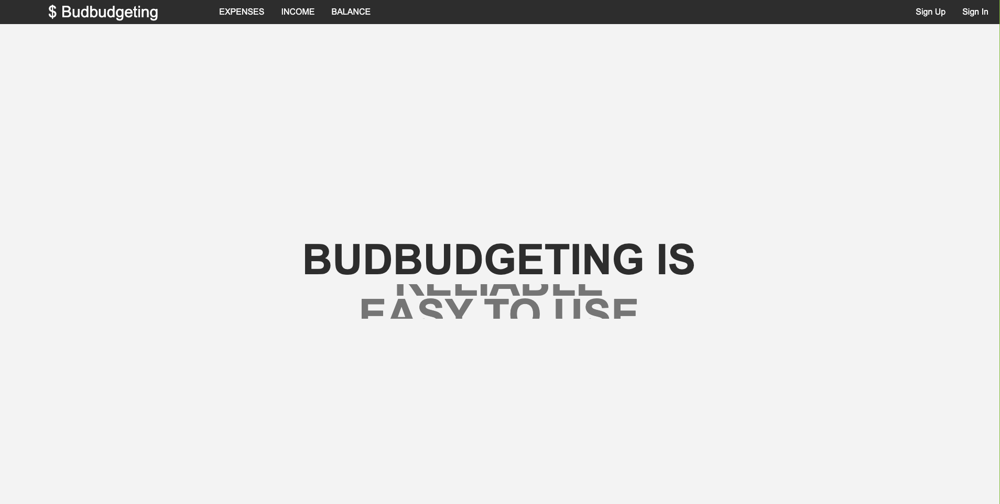
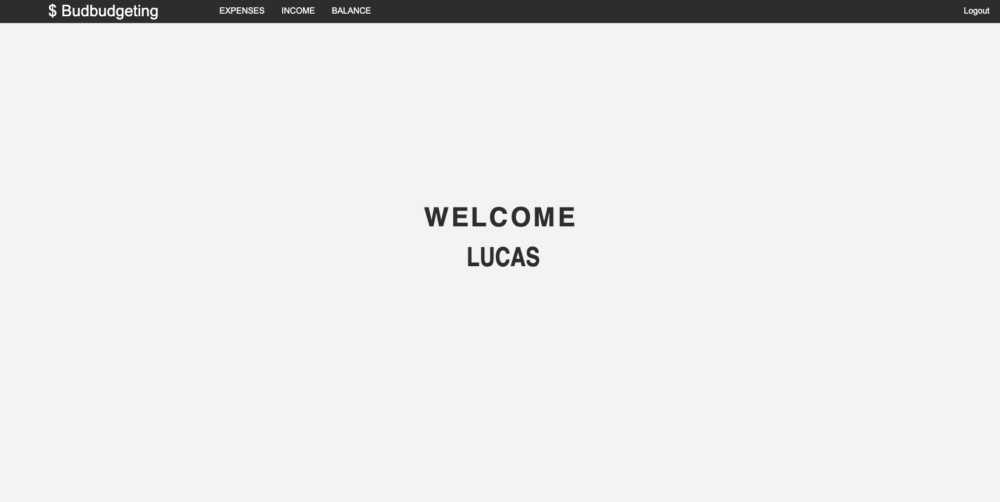
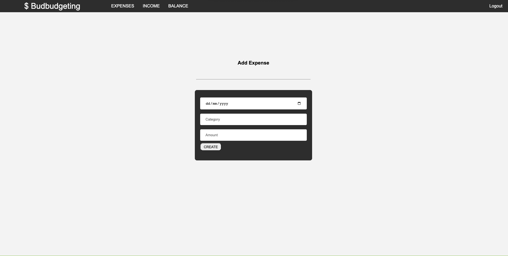
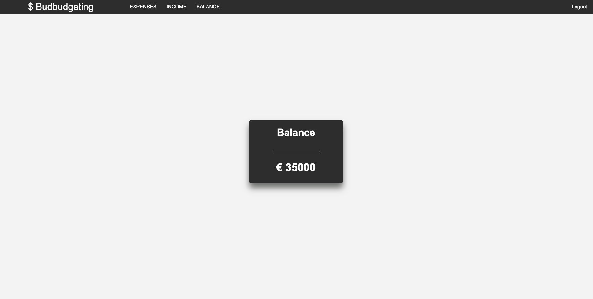
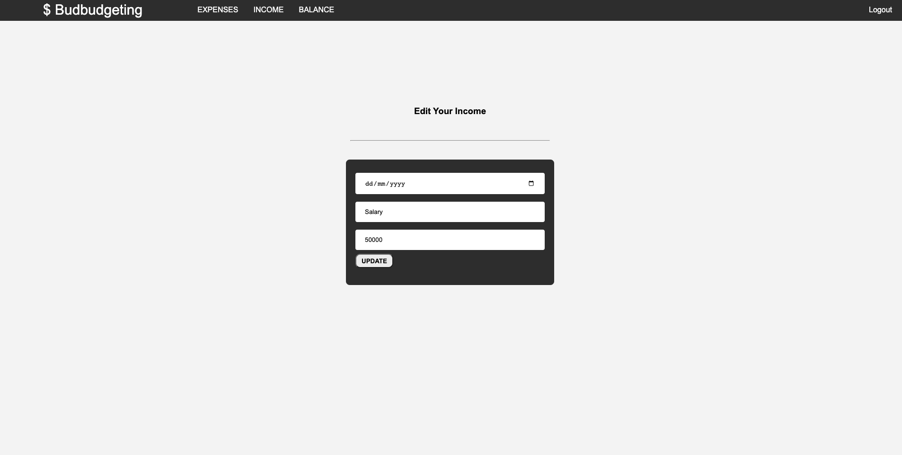

# Budbudgeting

## About

Budbudgeting is a comprehensive financial management platform designed to empower individuals in effectively tracking and controlling their finances. Our user-friendly platform allows users to effortlessly add their income and expenses, providing a real-time balance based on the information inputted. With Budbudgeting, users can gain valuable insights into their spending patterns. Our aim is to simplify personal finance management, helping individuals achieve greater financial stability and control. Experience Budbudgeting today and take charge of your financial future.

## Application Link

https://budbudgeting.adaptable.app/

## How to run the application

First Step: Install dependencies (ex: npm install)

Second Step: Run the following code on the terminal: ----- > npm run dev

### Step 1: Logging in

Visit the Budbudgeting website and click on the "Log In" button.
Enter your username and password to log into your account. If you're a new user, click on the "Sign Up" button to create a new account.

### Step 2: Adding income

After logging in, you'll be directed to your home page. To add your income, locate the "Income" button on the menu and click on it.
Enter the details of your income, such as the date, amount. You also need to categorize the income (e.g., salary, freelance work) for better tracking.
Click on the "Create" button to add the income to your financial information.

### Step 3: Adding expenses

After logging in, you'll be directed to your home page. To add your income, locate the "Expenses" button on the menu and click on it.
Enter the details of your expense, such as the date, amount. You also need to categorize the expense (e.g., Groceries, Home, etc.) for better tracking.
Click on the "Create" button to add the income to your financial information.

### Step 4: Viewing your balance

On the menu, you should see a button called "Balance" that displays your current balance. This balance is calculated based on your income and expenses.
The balance may be shown as a positive or negative number, indicating whether you have a surplus or a deficit in your finances.
The balance should automatically update whenever you add or modify income or expense entries.

### Step 5: Editing or deleting entries

If you need to edit or delete a previously added income or expense entry, navigate to the "EXPENSE LIST OR INCOME LIST" on the menu.
Locate the entry you wish to modify and look for an "Edit" or "Delete" button/icon associated with it.
Click on the appropriate button/icon, make the necessary changes, and save the updated information.

